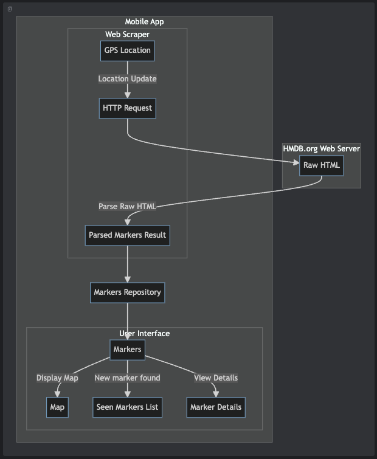

_note: link to play store not publicly active yet_

# Fred's Roadtrip Storyteller
Listen to historical markers as you travel - Learn about local history as you drive.

- KMP (Kotlin Multi-Platform) Compose-based Proof-of-concept experimental app using Google Maps for iOS and Android.
- Pure Kotlin App using _SHARED_ core and _SHARED_ Compose based UI, running in native Kotlin.

### YouTube series following the development of the app: 

### Assets
- Wiki: [Fred's Roadtrip Storyteller Wiki](https://github.com/realityexpander/FredsRoadtripStoryteller/wiki)
- Link to Marketing site source: https://github.com/realityexpander/FredsRoadtripStorytellerWebsite
- Link to Marketing Site: https://FredsRoadtripStoryteller.com

<!-- img width="1700" alt="image" src="https://github.com/realityexpander/GoolgeMapsUsingCocoaPodsExample/assets/5157474/7b0395d3-04e6-48df-9219-990cb10d81e1" -->
## Screen Shots

### Android Screenshots

### iOS Screenshots
_note: screenshots may differ slightly from current version_

## External Locations for Promoting Project
- https://medium.com/@chrisathanas/
- https://www.youtube.com/@ChrisAthanas

- Join the KMP Developers Group:
  - Twitter/X: https://twitter.com/i/communities/1739883885658607808
  - LinkedIn: https://www.linkedin.com/groups/14367209
  - FaceBook: https://www.facebook.com/groups/913147236893976

## Application Architecture
- 

# Developer notes

Source: (Code snapshot taken 10/8/23)
https://github.com/JetBrains/compose-multiplatform/tree/master/examples/cocoapods-ios-example

- Must create `AppSecrets.plist` from within Xcode - in password vault
- Can get `google-services.json` from Google Cloud Console
- must do `pod install` from the `iosApp` folder

- Note: There are many spurious warning messages and pop-up warnings. It seems these can be safely ignored.

## Latest commit Ran & Built with:
* Android Studio Iguana | 2023.2.1 RC 2
* Build #AI-232.10227.8.2321.11429013, built on February 9, 2024
* Runtime version: 17.0.9+0-17.0.9b1087.7-11185874 aarch64
* VM: OpenJDK 64-Bit Server VM by JetBrains s.r.o.
* macOS 13.6.3
* GC: G1 Young Generation, G1 Old Generation
* Memory: 4096M
* Cores: 10
* Metal Rendering is ON
* Registry:
* analyze.exceptions.on.the.fly=true
* debugger.new.tool.window.layout=true
* ide.tooltip.initialDelay=812
* ide.experimental.ui=true
* ide.browser.jcef.gpu.disable=true
* 
* Non-Bundled Plugins:
* com.c5inco.modifiers (1.0.14)
* com.intellij.javafx (1.0.4)
* com.intellij.marketplace (232.10227.13)
* wu.seal.tool.jsontokotlin (3.7.4)
* org.jetbrains.kotlin (232-1.9.20-RC2-release-495-AS10072.27)
* idea.plugin.protoeditor (232.9559.10)
* com.wakatime.intellij.plugin (14.3.11)
* com.github.airsaid.androidlocalize (3.0.0)
* DBN (3.4.3073.0)
* net.seesharpsoft.intellij.plugins.csv (3.3.0-232)
* com.jetbrains.kmm (0.8.2(232)-20)
* com.squareup.sqldelight (2.0.1)
* com.developerphil.adbidea (1.6.13)
* org.jetbrains.compose.desktop.ide (1.6.0)
* by.overpass.svg-to-compose-intellij (0.14)
* com.github.copilot (1.4.18.4775)
* mobi.hsz.idea.gitignore (4.5.2)
* com.abeade.plugin.figma.import (1.3.0)
* 

### Code style
  - https://github.com/realityexpander/FredsRoadtripStoryteller/blob/main/raw_assets/CodeStyle.md

### KMP Stuff
- KMP Wizard
  - https://terrakok.github.io/Compose-Multiplatform-Wizard/

- All kinds of libraries
  - https://github.com/terrakok/kmp-awesome
- Settings
  - https://github.com/russhwolf/multiplatform-settings
- Storage (Store5)
 - https://github.com/MobileNativeFoundation/Store

- Location KMM implementation concept
  - https://github.com/line/abc-kmm-location

- kSoup - HTML parser for scraping web pages
  - This thing is a hack and a half way of scraping, but until jSoup is ported, its what we got. 
  -https://github.com/MohamedRejeb/ksoup

- Painter resources
  - https://github.com/JetBrains/compose-multiplatform/blob/master/tutorials/Image_And_Icons_Manipulations/README.md

- Material Design 3
- https://material.io/blog/material-3-compose-1-1
- Drawers
- https://developer.android.com/jetpack/compose/components/drawer

- WebView
- https://github.com/KevinnZou/compose-webview-multiplatform/blob/main/sample/shared/src/commonMain/kotlin/com/kevinnzou/sample/BasicWebViewSample.kt

- Screen Orientation
- https://youtrack.jetbrains.com/issue/KT-58292
- https://www.geeksforgeeks.org/detect-screen-orientation-in-android-using-jetpack-compose/
- https://codingwithrashid.com/how-to-get-screen-orientation-in-android-jetpack-compose/

- Build Config
- https://github.com/gmazzo/gradle-buildconfig-plugin

- Lottie for Compose (Android only?)
- https://github.com/airbnb/lottie/blob/master/android-compose.md

### Android
- Adding markers
 - https://www.geeksforgeeks.org/how-to-add-multiple-markers-to-google-maps-in-android-using-jetpack-compose/

- Background tracking
  - https://github.com/realityexpander/BackgroundLocationTracking/blob/master/app/src/main/java/com/realityexpander/backgroundlocationtracking/LocationClientImpl.kt

- Location Visualizer
  - https://github.com/JetBrains/compose-multiplatform/blob/7c2bec465489d706451fa3ad5810d060f5bc7773/examples/imageviewer/shared/src/commonMain/kotlin/example/imageviewer/view/LocationVisualizer.common.kt
  - https://github.com/JetBrains/compose-multiplatform/blob/7c2bec465489d706451fa3ad5810d060f5bc7773/examples/imageviewer/shared/src/iosMain/kotlin/example/imageviewer/view/LocationVisualizer.ios.kt

- Problems
- Clustering markers not updated
  - https://github.com/googlemaps/android-maps-compose/issues/269

- Compose Clustering
  - https://betterprogramming.pub/clustering-with-maps-compose-for-android-911a2fe3f08b  

- Compose Samples
  - https://github.com/android/compose-samples  

- Billing
- https://developer.android.com/google/play/billing/integrate
- https://medium.com/androiddevelopers/working-with-google-play-billing-part-2-b859b55426d2
- https://developer.android.com/google/play/billing/errors
- Nice example in compose: https://www.answertopia.com/jetpack-compose/a-jetpack-compose-in-app-purchasing-tutorial/
- Book from the author: https://www.ebookfrenzy.com/pdf_previews/JetpackCompose1.4EssentialsPreview.pdf
- Handling test licenses: https://play.google.com/console/u/2/developers/7466162782462237210/license-tester
- In-app products dashboard: https://play.google.com/console/u/2/developers/7466162782462237210/app/4975423493158681529/managed-products
- https://developer.android.com/google/play/billing/integrate
- https://reintech.io/blog/implementing-in-app-purchases-kotlin-google-play-billing-library
- https://support.google.com/googleplay/android-developer/answer/1153481?hl=en&sjid=4505455023269193106-NC#zippy=%2Ccreate-a-single-in-app-product
- https://www.namiml.com/blog/set-up-iap-google-play-android-app

### iOS
- https://developers.google.com/maps/documentation/ios-sdk/utility/setup
- Location Manager
  - https://developers.google.com/maps/documentation/ios-sdk/current-place-tutorial
- Map Utils (clustering)
- https://github.com/googlemaps/google-maps-ios-utils

- Long running background location updates
  - https://developer.apple.com/forums/thread/69152

- Location picker
  - https://github.com/almassapargali/LocationPicker
  - https://github.com/alessiorubicini/LocationPickerForSwiftUI/blob/master/Sources/LocationPicker/MapView.swift

- Touch map for location
  - https://stackoverflow.com/questions/34431459/ios-swift-how-to-add-pinpoint-to-map-on-touch-and-get-detailed-address-of-th

- Continuous updates
  - https://developer.apple.com/forums/thread/124048

- How to convert iOS UIImage to Compose ImageBitmap in Compose Multiplatform?
  - https://slack-chats.kotlinlang.org/t/12086405/hi-all-how-to-convert-ios-uiimage-to-compose-imagebitmap-in-

- Maps stuff
- Override MKMapViewDelegateProtocol in Compose Multiplatform to receive pin selected events
- https://stackoverflow.com/questions/77266473/override-mkmapviewdelegateprotocol-in-compose-multiplatform-to-receive-pin-selec

- How to programmatically select annotation in Google Maps iOS?
- https://stackoverflow.com/questions/49156832/ios-google-map-programmatically-select-annotation-swift

- SwiftUI iOS 14 MapKit Annotation Tap Gesture (didSelect)
- https://developer.apple.com/forums/thread/659748

- Meet MapKit for SwiftUI
https://developer.apple.com/videos/play/wwdc2023/10043/

-[Solved] iOS 17 MapKit: How to use Map(selection:)?
-https://www.hackingwithswift.com/forums/swiftui/ios-17-mapkit-how-to-use-map-selection/22886

https://www.hackingwithswift.com/books/ios-swiftui/integrating-mapkit-with-swiftui

- STORE stuff
- StoreHelper Quick Start: https://github.com/russell-archer/StoreHelper/blob/main/Documentation/quickstart.md
- StoreHelper Guide https://github.com/russell-archer/StoreHelper/blob/main/Documentation/guide.md#get-started

- Simulate Location
- https://gpx-poi.com/

### Dev notes
- Why mutableStateList
  - https://stackoverflow.com/questions/67252538/jetpack-compose-update-composable-when-list-changes
- KMM Location services example app
  - https://medium.com/rapido-labs/building-a-kotlin-multiplatform-mobile-sdk-for-location-related-services-488a2855ab23

- Kotlin Swift - Jetpack Compose iOS, ComposeUIViewController, UIViewControllerRepresentable, UIKitView...
  - https://appkickstarter.com/blog/kotlin-swift

### Asset links

## Potential app names:
- https://www.mightynetworks.com/app-name-generator

icons: https://www.google.com/search?q=flat+icons+navigation&sca_esv=585465592&tbm=isch&sxsrf=AM9HkKkbHZOj7DIYI42VD56hpTfPgmYrYQ:1701032930698&source=lnms&sa=X&ved=2ahUKEwj_kte8yeKCAxVQIEQIHeeIDDsQ_AUoAXoECAIQAw&biw=1622&bih=1050&dpr=2#imgrc=Tx7XOXuIaxmJtM

Play store badge generator: https://play.google.com/intl/en_us/badges/

Privacy Policy: https://www.privacypolicygenerator.info/ 
https://www.privacypolicygenerator.info/download.php?lang=en&token=dhslNflkEHizHHbsBssrE8zM1p5AXwnR

Firebase console: https://console.firebase.google.com/u/0/project/talkingmarkers/overview

## Photo editors
- Photoshop editor: https://www.photopea.com/

- Location Markers
- https://pngtree.com/so/location-marker
- https://www.vecteezy.com/png/22187039-map-location-pin-icon
- https://www.google.com/imgres?imgurl=https%3A%2F%2Fpng.pngtree.com%2Fpng-vector%2F20210214%2Fourmid%2Fpngtree-location-marker-png-image_2921053.jpg&tbnid=0jAIDviURQ9mpM&vet=12ahUKEwiMqrbUkZWCAxWFz8kDHe1nDRoQMygGegQIARBU..i&imgrefurl=https%3A%2F%2Fpngtree.com%2Fso%2Flocation-marker&docid=MUeqs9oCST4JyM&w=360&h=360&q=location%20marker%20map%20%2Bfree&ved=2ahUKEwiMqrbUkZWCAxWFz8kDHe1nDRoQMygGegQIARBU
- https://www.google.com/search?q=location+marker+map+%2Bfree&tbm=isch&ved=2ahUKEwj8wsnbkJWCAxUhFN4AHVAFAicQ2-cCegQIABAA&oq=location+marker+map+%2Bfree&gs_lcp=CgNpbWcQAzoECCMQJzoGCAAQCBAeOgQIABAeUNcEWNoUYLoXaABwAHgAgAG9AYgB9wWSAQM0LjOYAQCgAQGqAQtnd3Mtd2l6LWltZ8ABAQ&sclient=img&ei=mhk7ZfyNMaGo-LYP0IqIuAI&bih=1050&biw=1698
- 

- Material Design Palette
- https://materialpalettes.com/

# Original Readme:

## [Compose Multiplatform](https://github.com/JetBrains/compose-multiplatform) iOS CocoaPods example

This example showcases using Kotlin Multiplatform shared module in Swift as a CocoaPods framework.

The official Kotlin documentation provides more information on working with CocoaPods:
* [CocoaPods overview and setup](https://kotlinlang.org/docs/native-cocoapods.html);
* [Add dependencies on a Pod library](https://kotlinlang.org/docs/native-cocoapods-libraries.html);
* [Use a Kotlin Gradle project as a CocoaPods dependency](https://kotlinlang.org/docs/native-cocoapods-xcode.html);

## Setting up your development environment

To setup the environment, please consult these [instructions](https://github.com/JetBrains/compose-multiplatform-template#setting-up-your-development-environment).

## How to run

Choose a run configuration for an appropriate target in IDE and run it.

