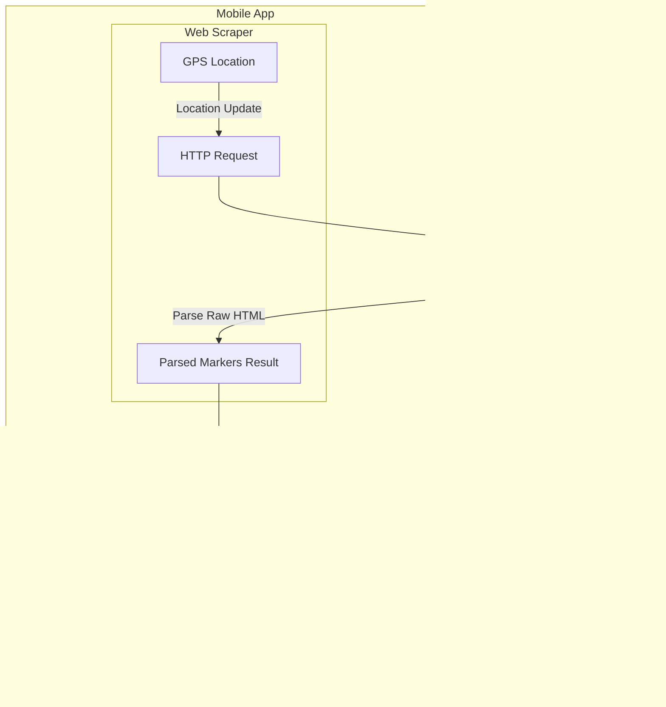

# Application Architecture

```mermaid
   
   graph TB

   subgraph Server["HMDB.org Web Server"]
     RawHTML[Raw HTML]
   end
   
   HTTP_Request["HTTP Request"] --> RawHTML
   
   subgraph A["Mobile App"]
      
      subgraph Scraper["Web Scraper"]
         GPS[GPS Location] -->|Location Update|HTTP_Request
         RawHTML -->|Parse Raw HTML| ParseResult
      end
         ParseResult["Parsed Markers Result"] --> Repo
      
      subgraph "User Interface"
         Markers -->|Display Map| A2[Map]
         Markers -->|New marker found| B2[Seen Markers List]
         Markers -->|View Details| C2[Marker Details]
      end
   end
   Repo --> Markers
   
   subgraph Repo[Markers Repository]
      Markers[Markers]
   end

```
